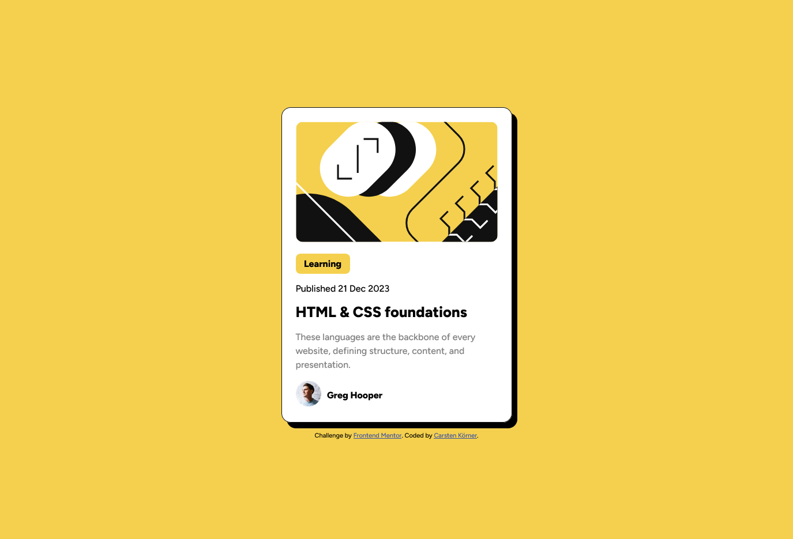

# Frontend Mentor - Blog preview card solution

This is a solution to the [Blog preview card challenge on Frontend Mentor](https://www.frontendmentor.io/challenges/blog-preview-card-ckPaj01IcS). Frontend Mentor challenges help you improve your coding skills by building realistic projects. 

## Table of contents

- [Overview](#overview)
  - [The challenge](#the-challenge)
  - [Screenshot](#screenshot)
  - [Links](#links)
- [My process](#my-process)
  - [Built with](#built-with)
  - [What I learned](#what-i-learned)
  - [Continued development](#continued-development)
- [Author](#author)

## Overview

### The challenge

Users should be able to:

- See hover and focus states for all interactive elements on the page

### Screenshot

### Links

- Solution URL: [Add solution URL here](https://your-solution-url.com)
- Live Site URL: [Add live site URL here](https://carstenkoerner.github.io/blog-preview-card/)

## My process

### Built with

- Semantic HTML5 markup
- CSS custom properties
- Flexbox
- BEM

### What I learned

I have learned to use clamp(..vw..) to set the font-size, line-height and the size of the avatar image depending on the width of the viewport. I found that very interesting.
I was a bit confused about the fact that the focus state for interactive elements should be set in addition to the hover state. I only know the focus state for the keyboard tab control for input fields. As there are no input fields in this project, I have omitted the focus state.

### Continued development

For now, I would like to continue to concentrate on the possibilities for creating responsive pages. But I'm also looking forward to starting with JavaScript soon.

## Author

- Frontend Mentor - [@carstenkoerner](https://www.frontendmentor.io/profile/carstenkoerner)